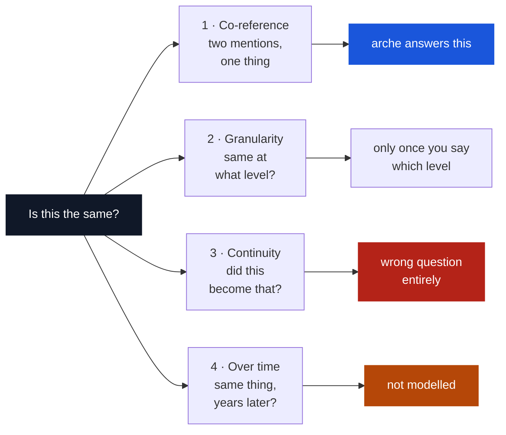

# Sameness and similarity

*Why no matcher can tell you two records are the same thing, what it tells you instead, and whether a frontier model changes the answer.*

<div class="arche-path">
<span class="path-label">Reading path</span>
<a href="../the-whole-picture/">1. The whole picture</a>
<span class="sep">&rsaquo;</span>
<span class="here">2. Sameness and similarity</span>
<span class="sep">&rsaquo;</span>
<a href="../arche-in-practice/">3. arche in practice</a>
</div>

---

## You are on reception, and there are two files

Someone is booking in at a clinic. You search the system and two records come back.

```text
John Smith        14 Oak Road, Leeds     +44 7700 900123
John Doe Smith    14 Oak Road, Leeds     +44 7700 900123
```

First name agrees, letter for letter. Surname agrees. Address agrees. Phone agrees. The only difference is that one has a middle name and the other does not, which is exactly what happens when the same person books in twice and a receptionist types what they hear.

The software says **0.9985**.

Do you merge them?

Think about what each mistake costs, because they are not the same size. If these are one man and you keep two files, his history is split and the next doctor sees half of it. If these are two men. A father and a son at the same address, sharing a landline, and you merge them, one person's medical record is now inside another's, and there is no undo.

The 0.9985 does not tell you which. It was never answering that question.

### Watch what actually decides it

Here is the same pair, run twice. The only change is whether a phone number is on file.

<details class="arche-examples" open>
<summary>The number barely moves. The answer changes completely.</summary>
<div class="arche-pairs">
<div class="pair match">
  <div class="pair-records">
    <code>John Smith        14 Oak Road, Leeds   +44 7700 900123</code>
    <code>John Doe Smith    14 Oak Road, Leeds   +44 7700 900123</code>
  </div>
  <div class="pair-verdict">merge</div>
</div>
<p class="pair-why"><strong>score 1.0 · cleared by: phone</strong> — a phone number is <em>distinctive</em>. Not many people share one, so agreeing on it is real evidence. And the name agreed independently, so the decision is recorded as <code>corroborated</code>: two separate reasons, not one.</p>
<div class="pair review">
  <div class="pair-records">
    <code>John Smith        14 Oak Road, Leeds</code>
    <code>John Doe Smith    14 Oak Road, Leeds</code>
  </div>
  <div class="pair-verdict">review</div>
</div>
<p class="pair-why"><strong>score 0.9974 · nothing distinctive cleared</strong> — take the phone away and all that is left is a common name and a shared address. Plenty of people are called John Smith, and people who live together share an address. Two weak signals do not add up to a strong one. <strong>This one is yours to decide.</strong></p>
</div>
</details>

**0.9985, 0.9974, 1.0. The number hardly moves across all three.** The decision moves from *merge* to *I don't know*. So whatever the score is measuring, it is not the thing you needed to know.

---

## Why no number can answer it

Because two different questions are being confused, and only one of them is measurable.

**Similarity is measured.** It is a fact about the records. How alike are these two strings, these two dates, these two addresses. You can compute it, and two people computing it get the same answer.

**Sameness is decided.** It is a claim about the world: that these two files are about one human being. That fact lives in the world, not in the paperwork, and no amount of studying the paperwork puts it there.

The everyday version: **identical twins.** Two records could agree on surname, address, date of birth, GP and school, and still be two people. Everything you can observe agrees, and the answer is still no. That is not a gap in your data collection you could close with one more field. You can always add a field and twins can always agree on it.

So a matcher is doing something more modest than it looks. It is not detecting sameness. It is **measuring resemblance and leaving you to decide**, and the honest thing for it to do is say so.

!!! note "The technical vocabulary, if you want it"

    Frege's terms are the precise ones. A record is a *reference*; the human being is the *referent*; two references with different senses can share a referent. "Damini Ogulu" and "Burna Boy" have different senses and one referent.

    That is why the function is `coref_references()` returning a `CoReferenceDecision`, and not `is_same()` returning true or false. **Co-reference is a relation between mentions**, which is something a person can adjudicate. **Identity is a relation between things**, which is not something a matcher can reach.

!!! warning "Where this argument is weaker than it looks"

    It is tempting to run this through Leibniz. Identity is indiscernibility, we only ever observe discernibles, therefore no measurement reaches sameness, and treat the philosophy as load-bearing.

    An adversarial review of this page called that "decorative philosophy," and the criticism is fair. **The operational argument for abstention is not metaphysical, it is decision-theoretic**: selective classification under asymmetric error costs and bounded human review capacity. Identity is purpose-dependent. Duplicate suppression, sanctions screening and household linkage have different loss functions and would draw the line in different places.

    The philosophy is a good intuition pump. It is not the reason. The reason is that a false merge and a missed match cost different amounts, and a system forced to always answer will assert things it has not earned.

---

## What the score actually is

The maths behind almost every matcher comes from one 1969 paper by Fellegi and Sunter, and the idea is simpler than the notation.

For each field, ask two questions:

- If these two records really *are* the same person, how often would this field agree? (call it **m**)
- If they really are *different* people, how often would it agree anyway? (call it **u**)

The gap between those two numbers is how much the agreement is worth. A shared phone number: **m** is high (same person, same phone) and **u** is tiny (strangers rarely share one), so agreement is strong evidence. A shared surname of Smith: **m** is high, but **u** is also high, because a great many unrelated people are called Smith. Same agreement, almost no evidence.

That is the whole trick. **Evidence is not agreement. It is agreement that would have been unlikely by chance.** Add up the evidence across fields and you get the score.

So the number is a *degree of belief under a model*: given these fields, these assumptions, this is how confident the model is. At 0.999 you have a very good bet. You do not have an observation.

### The correction we owe you

arche's `score` assumes something that is never true: that before looking at any evidence, two records are **equally likely** to be the same person as not. A coin flip.

Think about what that means on a real file. In a million-record register, pick two rows at random: the chance they are the same person is roughly one in a million, not one in two. So the number starts from a wrong assumption and reads high.

Worse, it *cannot* be fixed inside the current function, because `pairwise` never sees the file. The same two records in a small clinic list and a national register would need different answers and get the same one.

```text
John Smith / John Doe Smith, no phone on file
  score:     0.9974
  identity:  review
```

**A number reading 99.74% attached to an answer of *I don't know*.** The score still works for ranking. It puts the likeliest pairs at the top, and the thresholds are set on the same scale. It is not a probability that two records are the same person, and it is carried into signed artifacts where calling it one overclaims. [Splink](https://moj-analytical-services.github.io/splink/) handles this properly with an explicit prior.

This needs fixing. A project whose argument is *decisions should be honest about what they assert* cannot ship a signed field that asserts more than it knows. It also makes the case for the gate better than any argument could: **the score was 0.9974 and the refusal was right.**

---

## The third answer

The 1969 paper's real contribution was not the score. It was a decision rule with **three regions**:

| | |
|---|---|
| **A₁** | designate as a link |
| **A₂** | *fail to designate* — send to human review |
| **A₃** | designate as a non-link |

Their theorem is a Neyman–Pearson result: for fixed bounds on the two error rates, the likelihood-ratio ordering minimises the size of A₂. The optimal rule makes the fewest decisions it is not entitled to make.

Most production systems collapse this to a binary threshold, because a review queue costs salaries. That collapse is where systems begin asserting sameness they have not earned. arche keeps the third region as a first-class output: `identity ∈ {same_entity, review, different}` **is** A₁/A₂/A₃.

!!! danger "The condition that makes `review` honest, which we do not yet meet"

    Abstention is only principled if it is **precommitted**. Otherwise it is score avoidance. A system can manufacture perfect precision by routing every hard case away from the metric.

    A precommitted selective-risk policy requires: thresholds fixed on validation data before the test run, a review budget fixed in advance, review outcomes independently adjudicated, and end-to-end performance reported **including** the deferred cases.

    Our Febrl 4 result, precision 1.0 with ~12% sent to review, is reported without a fixed review budget and without costing the deferred cases. That is exactly the pattern the objection describes, and until the deferred slice is costed, read the 1.0 as *precision on the cases we chose to answer*, not as precision.

---

## The scissors

You have already met one half of this. **John Smith is a common name**, so two John Smiths are probably two people. That is the problem where a matcher says *same* and is wrong.

There is an opposite problem, and it is the one that gets missed.

Consider a woman whose family name is written **Diallo** in Guinea, **Jallow** in the Gambia and **Jalloh** in Sierra Leone. One family name, three colonial spelling conventions. To a computer comparing letters, `Diallo` and `Jallow` have almost nothing in common. They do not even start the same way. So the matcher says *different*, and it is wrong again, in the other direction.

This happens in Britain too, just less often: *Catherine* and *Kathryn*, *Mohammed* and *Muhammad*, *McDonald* and *MacDonald*. It is systematic wherever a name crossed a language, a border or a clerk's ear.

Now here is the trap. There is usually one dial on a matcher. A threshold, *how similar is similar enough*. And these two problems pull it in opposite directions.

<details class="arche-examples" open>
<summary>The two failures, and why one dial cannot fix both</summary>
<div class="arche-pairs">
<div class="pair match">
  <div class="pair-records">
    <code>Diallo</code>
    <code>Jallow</code>
  </div>
  <div class="pair-verdict">same</div>
</div>
<p class="pair-why"><strong>Dispersion.</strong> One Fula family name split by a colonial spelling border. String similarity finds almost nothing — Jaro–Winkler even pays a bonus for a shared <em>prefix</em>, tuned on US Census surnames, and these share none. The matcher is not broken; it encodes an assumption about how names vary that is false here. <strong>Raise the threshold and you lose this pair.</strong></p>
<div class="pair different">
  <div class="pair-records">
    <code>Ibrahim Musa   ·   Kano</code>
    <code>Ibrahim Musa   ·   Kano</code>
  </div>
  <div class="pair-verdict">different</div>
</div>
<p class="pair-why"><strong>Concentration.</strong> Identical strings, probably two men. In a city of millions, agreeing on a common name is weak evidence. <strong>Lower the threshold and you fuse these two.</strong></p>
</div>
</details>

The two arrows point opposite ways out of the same dial. Fixing one worsens the other, and the fixes are different *kinds* of object: an **equivalence relation** over surface forms, and a **frequency measure** over tokens.

That is the practical claim, and it is demonstrable. Here is the claim we are **not** entitled to make:

!!! note "Two problems, or one problem seen twice?"

    A reviewer put it directly: both cases are *estimating collision risk conditional on linguistic variation.* Dispersion needs a higher match likelihood; concentration needs a higher non-match likelihood. **Both can in principle be modelled inside one frequency-aware, group-aware probabilistic framework.** Separate artifacts may be good engineering. They do not prove two irreducible problem classes.

    That is correct, and it narrows the claim to something still worth saying: *the fixes that work on this data are shipped data, not better estimators.* One dial cannot do it. One well-specified model might. Nobody ships that model, and the reason is that it would need the same two facts as inputs.

This also cuts against a comfortable story about the packs. **An equivalence pack is dangerous by construction.** It converts uncertain linguistic resemblance into deterministic evidence, and a published fact that *Mohammed ≈ Mamadou* is also a published instruction for crafting a name that merges into someone else's identity. Packs need provenance, scope, versioning, locale conditions and a measured **false-equivalence rate**, not just a pairwise F1. We ship the first few and not the last.

---

## The same two failures, in three different worlds

This is not a names problem. It is what happens whenever people write down the same thing more than once, and it shows up identically in addresses and in products.

### Addresses, which is really a geocoding problem

<details class="arche-examples" open>
<summary>Same flat, two conventions. And a street name that identifies nobody.</summary>
<div class="arche-pairs">
<div class="pair match">
  <div class="pair-records">
    <code>23A Marchant House, Jubilee Street, London</code>
    <code>Flat A, Top Floor, Marchant House, 23 Jubilee Street, Fulham</code>
  </div>
  <div class="pair-verdict">match</div>
</div>
<p class="pair-why">One address, written by two organisations that disagree about where the flat number goes. Fulham is inside London, so the locality difference is containment rather than conflict. Letter-by-letter comparison scores this badly.</p>
<div class="pair review">
  <div class="pair-records">
    <code>12 High Street</code>
    <code>12 High Street</code>
  </div>
  <div class="pair-verdict">review</div>
</div>
<p class="pair-why">High Street is the most common street name in Britain. There are thousands of them, and hundreds will have a number 12. These strings are identical and they identify nobody. Same for Church Road, Station Road, and Main Street in the United States.</p>
</div>
</details>

This is exactly why address matching and geocoding go wrong in the same two ways. A geocoder that treats every matching word as equally meaningful will happily place a delivery, an ambulance, or a supplier audit on the wrong High Street, with high confidence, because the words did all agree.

### Products, plus a twist people miss

Dispersion looks like this:

```text
Coca-Cola Classic 330ml can
Coke Can 330ML
Coca Cola, 330 ml
```

Three listings, one drink. No two of them are written the same way, and a retailer's catalogue is full of this.

Concentration looks like `Black T-Shirt`, `Blue Jeans`, `USB Cable`. Thousands of genuinely different products share those words, so agreeing on them is worth nothing at all.

Products add a third problem that people and places do not have. Ask *is this the same product* and the question is unfinished, because two cans of Coke are the same **brand**, the same **product line**, the same **batch**, and different **cans**. Until you say which level you mean, there is no answer to give. UNTP's product passport carries a granularity field for exactly this reason.

### Why it repeats

Every one of these is the same shape. Something in the world gets written down by different people, in different systems, at different times. Some of them write the same thing differently. Others write different things the same way. The first costs you a missed match, the second costs you a wrong merge, and one threshold cannot fix both.

---

## The gate

The standard approach adds up the evidence and compares it to a threshold. arche adds one more requirement that the score cannot override:

> **Nothing merges unless at least one piece of evidence is genuinely distinctive.**

Distinctive means *few people share this*. A phone number qualifies. A national ID qualifies. An unusual surname qualifies. "Smith" does not, however perfectly it agrees.

The system keeps a measure of how ordinary each name is, on a scale where 0.75 is the bar:

```text
smith          0.46   ← far too common to identify anyone
ibrahim        0.57
musa           0.73   ← close, and still not enough
oluwaferanmi   0.86   ← rare enough to mean something
```

That is why the John Smith pair with no phone came back `review`. Nothing on the record was distinctive. Put the phone back and it clears immediately, and the decision is marked `corroborated`. The phone opened the gate *and* the name agreed on its own, so there are two independent reasons rather than one.

A phone match with **nothing else** agreeing returns `hold`, not `merge`: a single shared number is worth believing and not worth fusing two files over.

That second axis matters: **believing two records match and fusing them are different acts.** A belief costs nothing to revise; in most systems a merge is irreversible.

The gate is not a cleverness. It is a **values statement written as code**. In an identity system a false merge is worse than a missed match, because a false merge puts a stranger's history in someone's file. No amount of intelligence tells you that. It is a claim about whose harm counts, and it is written explicitly so it can be argued with.

---

## Four kinds of sameness

"Is this the same?" is four different questions, and conflating them is why supply-chain traceability projects overpromise.



**1 · Co-reference.** Persons, facilities, cooperatives, companies. A true equivalence relation, and what arche implements.

One principle sharpens here: **an equivalence relation is a claim about which transformations preserve reference, and that claim is entity-type-scoped.** *Mohammed ≈ Mamadou* preserves reference for people and destroys it for buildings. *Fatima Hospital* and *Fatouma Hospital* are plausibly two facilities named after two different women. So the place comparator is deliberately lexicon-free. A pack applied to the wrong type is worse than no pack.

**2 · Granular identity.** For products, "same product?" is ill-posed. Two tins of tomatoes are the same *model*, same *batch*, different *items*. UNTP's Digital Product Passport carries `idGranularity` for exactly this reason. Sameness here is a *family* of relations indexed by a parameter, and a system that does not carry the parameter answers a different question than the one asked.

**3 · Continuity.** Two hundred farms' cocoa enters one container. The question is not *are these the same* but *did this become that*. Directed, non-symmetric, **not an equivalence relation**. Under commingling, identity genuinely does not survive: the referent has become a mass balance, not an object.

This yields a sharp claim about why traceability underdelivers. A system modelling lot identity as co-reference must either assert false precision. *this bar came from this farm*, when it came from a blend, or collapse into uselessness. The honest split puts **stable entities** (farmers, plots, cooperatives, facilities) on the co-reference side and **flows** on the mass-balance side. The bookkeeping half has standards. The party join does not, and it is unsolved precisely because nobody separated it from the bookkeeping.

**4 · Diachronic identity.** *Fatima Abdullahi* in a 2015 register and *Hajiya Fatima Muhammad* in a 2023 one may be one woman, where the link is **biographical, not orthographic**. No equivalence pack contains it and no frequency table prices it, because the transformation is an event in a life rather than a property of a writing system. Co-reference decisions therefore have a validity period, and arche does not model one. Named here so it is not mistaken for solved.

---

## Transitivity, the deepest version of the problem

Sameness is transitive. Similarity is not.

A~B at 0.95 and B~C at 0.95 with A~C at 0.30 is common. B is often a record with a truncated name plausibly close to two different people. So **pairwise scores are structurally incapable of yielding an identity partition.** Transitive closure over thresholded edges is fast and catastrophic in the tails: one wrong edge fuses two clusters permanently.

arche's shipped core is pairwise, and clustering is where a sameness claim actually gets committed. Across the whole field that stage has the weakest guarantees. What `review` buys is that the pairwise layer does not silently manufacture a transitive error. This is an open problem, stated as one.

---

## Does a frontier model dissolve all this?

The argument against us, at full strength: frontier AI aims to do everything a human can, better; LLMs already reach comparable accuracy on published entity-matching benchmarks; the remaining gaps are cost, context and hallucination; all three are improving. Therefore a hand-built representation engine is on a timer.

Steps one through three are largely right. Here is the concession that matters: **if arche's claim were "we are more accurate than a frontier model," that claim has a short and shortening life.** Quantitative gaps close, and betting against a curve someone is spending a hundred billion dollars to climb is not a strategy.

### A matcher compares; a model recalls and associates

The mechanisms differ, and the difference predicts where each wins. A matcher computes an explicit similarity function and combines field weights arithmetically. You can read every step. A model serialises both records into a prompt and predicts the next token. There is no comparison operator anywhere in it.

What that mechanism is made of, and the catch in each:

- **Memorised world knowledge.** *Burna Boy = Damini Ogulu* is a fact in the weights. But **an LLM's entity knowledge is distributed like fame.** It knows Burna Boy because Burna Boy is on the internet. It does not know Fatima Abdullahi of Kano, and never will, because she is not in any corpus and should not be. Linking to famous entities is largely solved; resolving records inside a private registry is a different task the model's biggest advantage does not reach.
- **Distributional similarity.** *Mohammed* and *Muhammad* land near each other because they are used alike. This captures dispersion well, without rules.
- **No frequency prior.** A model has no principled representation of *how common is this name in this population*. It has a vague sense from training frequency, which is internet text, which over-represents some populations by orders of magnitude.

Which maps onto the scissors almost exactly:

| | Dispersion — one name, many spellings | Concentration — many people, one name |
|---|---|---|
| **Frontier model** | **Strong.** Association is what it is for. | **Weak and biased.** No population measurement. |
| **arche** | Equivalence packs — explicit, correctable, limited to what is written down | Frequency tables — the population measurement |

**A prediction, stated before the experiment runs.** Frontier models should *beat* a string baseline on dispersion and *underperform* on concentration. If that pattern appears, the framing is right. If they win on both, we are wrong about something important, and that experiment has not been run, which is the largest hole in this page.

### But what if you just give the model the packs?

This is the sharpest version of the question, and it deserves a real answer rather than a defensive one.

Suppose you hand a frontier model the equivalence packs in its prompt. Now it knows that Diallo, Jallow and Jalloh are one name. Does that settle it?

**For the spelling problem, yes, and it probably did not need the pack.** Models are already good at this, because they learn that names appearing in similar contexts are related. This is the blade they were strong on to begin with.

**For the common-name problem, no, and the pack does not help at all.** Here is why, in one line:

> A list of nicknames tells you that Bill means William. It does not tell you how many Williams live in Leeds.

Those are different kinds of fact. An equivalence pack contains no counts. You cannot derive how common a name is in a population from a list of its spellings, any more than you could work out a city's population by reading a dictionary. The common-name failure needs a measurement of a population, and no amount of equivalence data contains one.

**So give it the frequency tables too?** Now it has everything. And this is the part worth sitting with, because it cuts against the comfortable version of our own story.

If a model with the packs and the tables performs well, **that does not refute the thesis. It confirms it.** The claim was never that models are bad at this. The claim is that the fix is a piece of data somebody has to build, and that nobody was building it. A model that succeeds *with* the data and fails *without* it is the argument, demonstrated with someone else's engine.

What that scenario does refute is any hope that the matching engine itself is valuable. If the data is what matters, and the data is openly licensed, then the engine is commodity. That is survivable, and it is roughly what the strategy already assumes: give the representation away, because a pack everyone corrects is a better pack, and sell the adjudication, the review workflow and the signature instead.

Three practical problems remain even in that world, and they are not about intelligence:

1. **Consistency at volume.** Deduplicating a million records means applying the same rule a million times, identically. A model applies a rule approximately, and two identical pairs at different points in the same run can come back differently.
2. **Adding up evidence is arithmetic.** Combining signals across fields is multi-step calculation. Models are unreliable at it and, more importantly, not reproducible at it.
3. **Price.** A frontier call per candidate pair, at ten million pairs, is a different business.

None of that is a moat. It is a reason the two-layer split makes sense: let the model propose, and let something cheap and deterministic decide.

**This is a testable question and we have not tested it.** The experiment is four arms on the same data: a plain string baseline, a model with no help, a model given the packs, and a model given the packs and the frequency tables. If arm three fixes only the spelling problem and arm four fixes both, the argument holds. If arm two fixes both on its own, we were wrong about something important.

### The structural claim, and its limits

> **Determinism is not on the capability curve.** A model does not become reproducible by becoming smarter.

Reproducibility is architected, not learned. A system that answers differently on rerun cannot be fixed by more intelligence, because the non-determinism is in sampling, versioning and context, not competence. That is a difference in kind rather than degree.

Three things capability does not confer: you cannot **observe an unobservable** (a superintelligence is better calibrated about sameness, not in a different epistemic relation to it); intelligence does not **choose the loss function** (which harm counts is not a capability question); and **liability is a social relation** (a tribunal needs to know what evidence was considered, which rule applied, who applied it, and whether the same inputs reproduce the same output today).

!!! warning "How much this argument actually proves"

    Less than it first appears, and the objections are worth stating in full.

    **Reproducibility is achievable elsewhere.** Version pinning, deterministic decoding, logged prompts and constrained generation can make a commodity pipeline sufficiently reproducible. This is engineering and governance, not a durable moat. **The real question is who pays for an audit trail**, and whether that willingness exceeds the cost of building one in-house.

    **The regulatory demand argument is thinner than it sounds.** GDPR Article 22 applies narrowly and fact-specifically; many linkage workflows are assistive rather than solely automated, and can be structured to stay that way. Compliance demand may favour *documentation and human override* rather than an adjudication product.

    **A signature is not accountability.** Attribution can create a blame record while supplying no contestability: no appeal route, no evidence retention policy, no reviewer competence control. arche today produces something a *regulator* can verify and nothing the *person whose records were merged* can challenge. That gap is both the most on-mission thing available to build and the reason "signed therefore accountable" does not follow.

### What would make this position wrong

1. **Institutions accept "the model said so."** If auditors and courts treat a model's judgment as sufficient, the adjudication layer has no buyer regardless of whether it is epistemically correct. Least under our control, and the one that would hurt most.
2. **Reproducible inference becomes routine.** Bit-reproducible, version-pinned frontier inference as a standard offering weakens the determinism argument considerably. The most plausible technical route to obsolescence, and worth watching more than capability benchmarks.
3. **A frontier model with no tools matches arche on both blades of the scissors.** Then representation was free with a good enough model, and the packs were a transitional artifact.

---

## The honest summary

**Sameness cannot be measured, so it must be asserted. An assertion has an author, a time, a policy and a jurisdiction, so the artifact of record must carry all four and be checkable by someone who does not trust the asserter.**

That is the derivation of [signed decisions](../how-to/re-verify-a-decision.md) from first principles rather than from feature envy. Not *"this is true"*, but *"given this evidence and these parameters, this is what the rule outputs, and here is who ran it."*

And the strongest case against the whole project, stated in its own words so it is not straw: **the defensible core may be Fellegi–Sunter plus a curated alias table, frequency features and a review queue. Every component standard.** The answer cannot be rhetoric. It has to be independent, out-of-domain, longitudinal results, and evidence that curation scales without becoming bespoke consulting. We do not have those yet. What we have is [measured, small, and published whichever way it falls](the-whole-picture.md).

---

## Acknowledgements

The shape of the argument here owes a lot to work published by other people, and it is worth naming which parts are borrowed.

The three-region decision rule, including the *fail to designate* region that most systems discard, is [Fellegi and Sunter's](https://www.tandfonline.com/doi/abs/10.1080/01621459.1969.10501049) from 1969. We did not invent abstention; we declined to throw it away.

[Robin Linacre's work on UK address matching](https://www.robinlinacre.com/address_matching/) reached the same conclusion about token frequency from a completely different starting point, and reached it first. His observation that a common token should count for almost nothing is the address version of everything on this page, and his willingness to say plainly that Fellegi–Sunter is the wrong model for addresses is the kind of honesty this field needs more of. [Splink](https://moj-analytical-services.github.io/splink/), which he leads, is the tool we tell people to use when their problem is inference rather than representation.

[`whereabouts`](https://github.com/ajl2718/whereabouts) independently arrived at "ship the prebuilt country data, keep the query simple." Three groups converging on the same bet from UK addresses, Australian addresses and personal names is better evidence than any argument we could make on our own.

[Shahbazi et al. (VLDB 2023)](https://arxiv.org/abs/2307.02726) established that entity-matching error rates differ across demographic groups and that standard benchmarks do not measure it. This page tries to propose a mechanism for that finding; the finding itself is theirs.

The adversarial review that produced the four warning boxes above was run with an independent model, deliberately prompted to attack rather than agree. Several of its objections survived into the text unchanged because we could not answer them.

## Notes

1. The identical-twins example is doing real work, not decoration. It shows the gap is not a data-collection problem you could close with one more field, because twins can agree on any field you add. What actually resolves it is a distinguishing observation, and there is no guarantee your data contains one.
2. The `score` figures quoted throughout come from running the pairs, not from illustration. Reproduce them with `resolve.pairwise` and the records printed alongside.
3. "Distinctive" has a specific meaning: a token is distinctive when few records share it, measured against a population table rather than against the two records being compared. A table built from the two lists in front of you cannot know that `Central` is ordinary.
4. The four-arm experiment described above is on the roadmap and has not been run. Until it has, the claim about where frontier models fail is a prediction, and it is written here in advance so it can be checked against the result rather than adjusted afterwards.

## Where to go next

Next in this path: **[arche in practice](arche-in-practice.md)**, on what changes about your working day.

Back to **[The whole picture](the-whole-picture.md)** for what is built and measured.

## Related

- [The whole picture](the-whole-picture.md). What is built, what is measured, and how the baselines were chosen
- [arche in practice](arche-in-practice.md). What this looks like when a person or an agent uses it
- [What matching looks like](what-matching-looks-like.md). The same failure modes across places, people, products and organisations

## References

- Fellegi, I. P. & Sunter, A. B. (1969). A Theory for Record Linkage. *JASA* 64(328).
- Bansal, N., Blum, A. & Chawla, S. (2004). Correlation Clustering. *Machine Learning* 56.
- Bhattacharya, I. & Getoor, L. (2007). Collective Entity Resolution in Relational Data. *ACM TKDD* 1(1).
- Shahbazi, N. et al. (2023). Through the Fairness Lens: Experimental Analysis and Evaluation of Entity Matching. *VLDB*.
- Regulation (EU) 2024/1689 (AI Act); GDPR Art. 22; Nigeria NDPA 2023.
