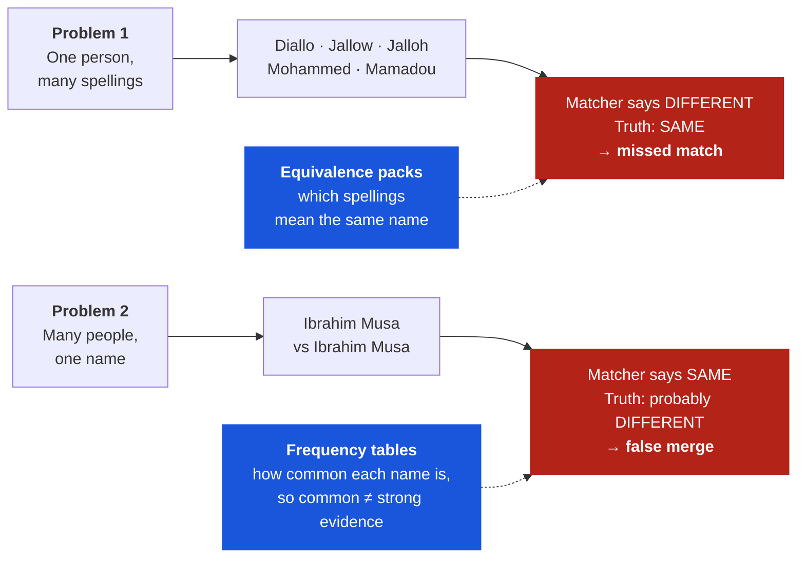

# The whole picture

*Where this came from, what is actually built, what has been measured, and what we have not proven. The shortest complete account. Start here.*

Reading path
1. The whole picture
&rsaquo;
<a href="../sameness-and-similarity/">2. Sameness and similarity</a>
&rsaquo;
<a href="../arche-in-practice/">3. arche in practice</a>

---

## The problem, in one sentence

You have records about people, places, or things. They came from different systems, written by different people, at different times. The same real-world thing appears in them under different names, and you have to decide which records are about which thing, in a way you can defend six months later.

Most tools give you a score. arche gives you a decision, the evidence behind it, the rule that produced it, and a signature, so someone who does not trust you can check it.

---

## How this got here

It started with a narrow, unglamorous observation.

Matching African names with off-the-shelf tools produced a false-merge rate around 40%. Not because the tools were badly built, but because their assumptions were made somewhere else. Jaro-Winkler, the string comparator underneath most of this work, gives a bonus when two names share an opening. That choice makes sense, because it was tuned on US Census surnames, where clerical typos usually happen at the end of a word. It falls apart on Diallo and Jallow, which are one family name and share no opening at all.

The first attempt was the obvious one: tune the threshold. It failed in a way that turned out to be the whole insight. Loosening it to catch Diallo and Jallow started merging unrelated people who happened to share a common name. Tightening it to stop that lost the spelling variants again. The dial was not badly set. The dial was the wrong instrument.

What fixed it was not a better algorithm. It was two pieces of data that nobody was shipping: a list of which spellings mean the same name, and a table of how common each name actually is.

Everything since has been finding out how far that generalises. Health facilities in Nigeria, where "Primary Health Centre" appears in thousands of names and carries no information. Places, where "High Street" does the same job. Products, where "Black T-Shirt" does. Then organisations, where a cooperative and the union above it can reduce to identical strings once you remove the legal form.

The pattern held every time. **The failures were in what the records looked like when they were compared, not in the mathematics that compared them.** That is the whole thesis, and it was discovered rather than designed.

---

## The one idea

Entity resolution has two halves, and the attention is on the wrong one.

**Inference** is the maths: given evidence of agreement, how likely is a match? This half is solved. It has a founding paper from 1969 and excellent free software. If this is your problem, use [Splink](https://moj-analytical-services.github.io/splink/). We mean that literally.

**Representation** is everything before the maths: what do the records look like when compared? What counts as agreement, and what is agreement *worth*?

A matcher compares "Diallo" and "Jallow" and finds almost nothing. It is not calculating wrong. It is calculating correctly on a representation that never contained the fact that these are one Fula family name split by a colonial spelling border. **No better probability model conjures a fact that is not there.** Someone has to put it there.

!!! note "Where that framing overreaches, and the version that survives"

    A reviewer pushed back hard: *"representation and inference are not cleanly separable. The comparison vector, blocking, missingness handling, priors and m/u estimates jointly define the effective representation. Claiming all real error lives before inference is false."*

    Correct. Calibration error, dependence violations and dataset shift are real and live on the inference side. The defensible claim is narrower and still worth making:

    **The fixes that work on this data are shipped data, not better estimators.** That is an empirical statement about where the repairs live, not a theorem about where error lives. It is why arche ships tables and vocabularies in the wheel, and why the roadmap says *consume, don't build* about the maths.

---

## Two problems, pulling opposite ways

This is the crux and it takes thirty seconds.

Turn the threshold up and you fix problem 2 while making problem 1 worse. Turn it down and the reverse. **One dial cannot fix both**, and the two fixes are different kinds of object.

That is why arche ships data, not just code. The [full argument, including where it is contestable](sameness-and-similarity.md), is a page of its own. A single well-specified frequency-aware model could in principle address both, and the honest claim is about what is shippable and measurable rather than what is mathematically irreducible.

---

## What is actually built

Version **0.4.0a1**. Five entity packs ship: `person`, `place`, `artist`, `product_electronics`, and `organisation`. A pack is configuration over one engine, never a fork.

| Layer | What it answers |
|---|---|
| **Detect** | what is in this data — names, IDs, phones, addresses, with the governing statute attached |
| **Declare + policy** | what may be compared — your fields mapped to slots, jurisdiction rules applied |
| **Represent** | what counts as agreement and what it is worth — packs, frequency tables, vocabularies |
| **Resolve** | same or not — score, then the distinctive-signal gate |
| **Attest** | can this be proven later — signed, recomputable by a third party |

Three answers, not two: `same_entity`, `review`, `different`. And a second axis. Believing two records match and *fusing* them are different acts, so `same_entity + hold` is a valid outcome.

`review` is not a cop-out. It is Fellegi and Sunter's third region A₂, in the founding paper since 1969, discarded by most production systems because a review queue costs salaries.

---

## What has been measured

Five results, and they are not the same kind of thing. One is a public labelled benchmark someone else built and baselined (organisation). One is a public corpus with known truth (Febrl). One is an ablation whose negatives come from a public register but whose positives we generated (name frequency). Two are sets we wrote ourselves (name equivalence, multilingual detection). **Read the caveats column as part of the number, not as a footnote.**

| What | Baseline | arche | Read it as |
|---|---|---|---|
| **Name equivalence** 58 pairs, 18 categories | Jaro–Winkler @ 0.80 F1 **0.8493** | F1 **0.9880** | Recall 0.738 → **0.976**, precision held at 1.000. **A demo, not a benchmark** — 58 pairs, and from v0.1.0. Needs re-running. |
| **Name frequency** 1,114 observed negatives 1,500 constructed positives | arche **minus the frequency signal** precision **0.162**, 7,705 false merges | precision **0.946** **41** false merges | Real voter records, and re-runnable. The effect is far larger than we used to claim, and it has a cost we never mentioned: recall **48%**. |
| **Scale (Febrl 4)** 10,000 records, truth known | name and address only precision **0.921**, 282 false merges | precision **1.000** with the synthetic ID in play | The 1.0 reproduces exactly, and is largely a **key join**. Withhold the identifier and the engine resolves 65.7% rather than 87.7%. |
| **Multilingual detection** 48 cases, 6 languages | Presidio **37/48** | **47/48** | **We cannot re-run this.** The set is not in the repo and nothing computes the number. Unverified until rebuilt. |
| **Organisation lane** 946 labelled pairs | token-sort F1 **0.8898** | F1 **0.9493** | False merges **21 → 4**. Public set, criteria declared before the run. Anglophone restaurant listings — **says nothing about African organisation names**. |

### How the baselines were chosen

This matters more than the numbers, because a benchmark with a badly chosen baseline proves nothing.

**The rule: change exactly one thing.** The frequency ablation is the clearest case. The baseline is not a strawman, it is **arche with the frequency signal switched off**. Same data, same comparator, same threshold. So the difference cannot be explained by anything else in the pipeline.

### The frequency row used to say something else

Until August 2026 this row read **40% → 0%, recall held at 1.00**, on 60 positives and 60 negatives we wrote ourselves. That number was not reproducible. The set was never committed, no script computed it, and the document this page cited for it did not exist. It has been replaced by [`bench_name_frequency.py`](https://github.com/unpatterned-labs/arche/blob/main/datasets/names_dataops/bench_name_frequency.py), which anyone can run.

The negatives are now **observed rather than written**: 1,114 pairs of real people from the North Carolina voter register who share a surname, differ in first name, and differ in birth year. Nobody chose how confusable their given names would be. The positives are still constructed, and the script says so on every line that reports them.

Two things came out of re-running it properly, and the second is why the row is worth trusting now.

**The effect is much larger than we claimed.** Not 40% of pairs wrongly merged but 7,705 wrong edges against 1,114 negatives, because a frequency-blind matcher run over two lists does not merely confuse a pair, it links nearly everything to nearly everything. Precision 0.162 against 0.946.

**And it costs recall, which the old claim denied outright.** "Recall held at 1.00" was wrong. Measured against same-person pairs differing only by a dropped middle name, the frequency-aware engine matches **48%**. The rest go to `review`. That is defensible — abstention is the design — but reporting a safety gain while asserting the cost was zero was not.

One more thing surfaced that we had not looked for. `person` is missing from the pack-to-table map, so `crosswalk(entity="person")` never loads the shipped population table and self-calibrates over the two lists instead. We expected that to be a defect. On this benchmark it is not: the self-calibrated default scores **F1 0.637** against the population table's **0.577**, buying 7 points of recall for 1.7 points of precision. The gap is real and unresolved, and it is recorded here rather than quietly fixed.

---

## What we have not proven

A page of wins with no losses is marketing. This section is the reason to trust the rest.

- **Some sets are small.** The name-equivalence set is 58 pairs. The frequency ablation is now 2,614, but its top band holds only 11 negatives, because Alamance County has just 11 surnames carried by 500 or more people. Read that band as noise.
- **We built some of them ourselves.** When the same team designs the negatives and the solution, a benchmark is vulnerable to target leakage and favourable case construction. The frequency negatives are no longer ours; its positives still are, and so is the whole name-equivalence set.
- **The frequency ablation is one county in one country.** Alamance County, North Carolina: US naming, US population structure. It says nothing about whether the effect holds on a Nigerian, Ghanaian or Kenyan register, which is exactly where this project claims its calibration is deepest. That benchmark does not exist and this is not it.
- **The multilingual result is not re-runnable and may not be recoverable.** The 48-case set is not in this repository and nothing here computes 47/48. The organisation lane, the frequency ablation, Febrl and Leipzig all ship a script and a committed result file. This one does not, and until the set is rebuilt it should be read as an assertion rather than a measurement. The same is true of the 58-pair name-equivalence set.
- **Three of our own numbers turned out to measure something other than the sentence around them.** Febrl's precision 1.0 reproduces exactly, and reaches 1.0 largely by joining on a synthetic near-unique identifier; withhold it and precision is 0.921. Leipzig's 0.9506 is the configuration with a discriminator declared on `year`, where out of the box the same pipeline scores 0.8500. The frequency claim omitted a recall cost of roughly half. None of these was fabricated. Each was a real run whose configuration stopped travelling with the number, which is a failure mode worth naming because it is quiet and it recurs.
- **`review` is not precommitted.** Abstention is only principled under a selective-risk policy: thresholds fixed on validation data, review budget fixed in advance, and end-to-end performance reported *including* deferred cases. We report precision 1.0 without costing the 12%. Until that is fixed, the number is narrower than it reads.
- **No head-to-head against frontier models.** The most important missing experiment, and the one most likely to prove us wrong.
- **The `score` is not a probability.** It assumes a uniform prior that is never right, and it is carried into signed artifacts. A project arguing for honest assertions cannot ship a field that overclaims.
- **The equivalence packs have no measured false-equivalence rate.** They convert uncertain linguistic resemblance into deterministic evidence. That needs provenance, scope, versioning and an error rate, not just an F1.
- **No African organisation-name ground truth exists.** Anywhere. Including here, where 259 rows sit staged for adjudication with zero labelled.

---

## Where the data comes from

The shipped frequency tables are built from public sources with checked licences:

| Table | Source | Licence |
|---|---|---|
| Person names | US Census 2010 surnames (162,253) + African names lexicon via Wikidata/ParaNames (13,342) | public domain · CC BY 4.0 |
| Places | Nigerian facility registries | open data |
| Organisations | GLEIF LEI Level 1 — 52,875 name forms | **CC0 1.0** |

Census counts run to millions and African counts top out near a thousand, so each source is normalised to a common total before merging. Otherwise Census drowns the African signal.

Every table has a curated half beside it, because **a corpus only knows the words that are in it.** GLEIF counts `farmers` exactly **once** in 52,875 organisation names, since cooperatives do not register LEIs. Measured alone, the table concludes `farmers` is a rare, identifying token. No larger pull fixes that. Someone who has read a supplier list has to assert it, and the YAML is where they do.

The packs and tables are open. CC BY 4.0, and take pull requests. An open pack that everyone corrects is a better pack, and the corrections are the flywheel.

---

## Where this sits against the field

Three projects have independently converged on the same architectural bet: **ship the representation data, keep the algorithm simple.**

| Project | Domain | Ships |
|---|---|---|
| [`uk_address_matcher`](https://www.robinlinacre.com/address_matching/) | UK addresses | the technique — and explicitly *rejects* Fellegi–Sunter for addresses |
| [`whereabouts`](https://github.com/ajl2718/whereabouts) | AU / US addresses | prebuilt country databases |
| **arche** | people, places, products, organisations | frequency tables, equivalence packs and vocabularies in the wheel |

That three groups reached "the data is the product, the algorithm is nearly trivial" from UK addresses, Australian addresses and personal names is the strongest support this thesis has that we did not generate ourselves.

### What arche covers, stated accurately

It is worth being precise here, because "an African name matcher" undersells what is shipped and oversells what is special.

The **scope** is general. The organisation table is built from company registrations across 45 jurisdictions. The product work is benchmarked on US retail catalogues. The place work runs on UK hospitals and Nigerian clinics alike, and the person tables merge US Census surnames with a multilingual name lexicon. Nothing in the engine is region-specific, and the examples throughout these pages are deliberately drawn from Britain, Kenya, Ghana, Nigeria and the United States.

The **differentiator** is narrower and worth naming plainly: arche is calibrated for the cases where standard tools assume a population they were not built for. Jaro-Winkler rewards a shared prefix because it was tuned on US Census surnames. Default frequency priors assume a name distribution that does not hold in a lot of the world. Those assumptions fail on Diallo and Jallow, and they also fail on Cantonese romanisation, on Arabic transliteration, and on any register where one family name has three spellings.

So the honest sentence is: **general-purpose entity resolution that ships its representation data, built by people who noticed the defaults first where the defaults break hardest.**

That framing also explains the remaining gap in the field. `whereabouts` ships Australia and the US, Linacre's work is the UK, and nobody ships the majority world. The problem is not that Africa needs a special engine. It is that the reference data everyone else takes for granted does not exist there yet, and reference data is the part that actually decides the answer.

And the strongest case against us, in its own words: **the defensible core may be Fellegi–Sunter plus a curated alias table, frequency features and a review queue. Every component standard.** The honest answer is not rhetoric. It is independent, out-of-domain, longitudinal results, and evidence that curation scales without becoming bespoke consulting. We do not have those yet.

---

## Where we are going

In dependency order, and the first item is not engineering.

**1 · Adjudicated African ground truth.** 150–300 stratified pairs including negatives, two annotators, false merges reported separately from misses. Every claim about African name or organisation matching is blocked on this, and no amount of compute substitutes for it.

**2 · Precommit the abstention policy.** Fixed review budget, thresholds set on validation data, deferred cases costed into the headline number. This turns `review` from a defensible design choice into a measured one.

**3 · The head-to-head.** Frontier models against both blades of the scissors. The prediction is stated in advance: strong on dispersion, weak on concentration. If they win on both, we are wrong about something important.

**4 · Close the honest defects.** Rename or re-derive `score`. Measure the packs' false-equivalence rate. Build a threat model before any deployment that decides benefits.

**5 · The contestability surface.** A signature that a regulator can check is not accountability if the person whose records were merged cannot see or challenge it. This is simultaneously the largest gap and the most on-mission thing available to build.

---

## Where to go from here

| If you want | Read |
|---|---|
| Why a matcher can never say *same*, and whether AI changes that | [Sameness and similarity](sameness-and-similarity.md) |
| What changes about your working day | [arche in practice](arche-in-practice.md) |
| The failure modes, side by side, with real verdicts | [What matching looks like](what-matching-looks-like.md) |
| How someone else checks your decision | [Re-verify a decision](../how-to/re-verify-a-decision.md) |
| To just use it | `pip install arche-core` |

## Acknowledgements

Most of the ideas here are borrowed, and it is worth being specific about which.

The three-region decision rule, including the *fail to designate* region that most production systems throw away, is [Fellegi and Sunter's](https://www.tandfonline.com/doi/abs/10.1080/01621459.1969.10501049) from 1969. We did not invent abstention. We declined to discard it.

[Splink](https://moj-analytical-services.github.io/splink/), from the UK Ministry of Justice, is the tool we point people to when their problem is inference rather than representation. That recommendation is sincere and it costs us nothing, because the two projects solve different halves.

[Robin Linacre's writing on UK address matching](https://www.robinlinacre.com/address_matching/) reached the token-frequency conclusion first, from addresses rather than names, and says plainly that Fellegi-Sunter is the wrong model for that domain. [`whereabouts`](https://github.com/ajl2718/whereabouts) reached the same architectural bet from Australian and US addresses. Three groups converging on "the data is the product" from three unrelated starting points is stronger evidence than anything we could assemble on our own.

[Shahbazi et al. (VLDB 2023)](https://arxiv.org/abs/2307.02726) established that entity-matching error rates differ across demographic groups and that standard benchmarks do not measure it. We try to propose a mechanism. The finding is theirs.

The name data builds on [ParaNames](https://arxiv.org/abs/2104.00558) and Wikidata, the US Census 2010 surname file, and [GLEIF's](https://www.gleif.org/en/about/open-data) CC0 release of legal-entity reference data. The benchmark sets come from the [Database Group at Leipzig](https://dbs.uni-leipzig.de/research/projects/benchmark-datasets-for-entity-resolution) and the ER_Magellan collection.

## Notes

1. Every figure on this page came from running the code. Where a number is stale, and the name-equivalence result predates the current version, it is labelled stale rather than quietly refreshed.
2. "Representation" is used narrowly here: the comparison vector and the data feeding it. A reviewer correctly pointed out that blocking, missingness handling and the m/u estimates also shape it, which is why the claim is about where the *fixes* live rather than where all error lives.
3. The organisation figures come from a public benchmark of Anglophone restaurant listings. They say nothing about the African organisation names the project is aimed at, and the roadmap treats closing that gap as adjudicator work rather than engineering.

## Where to go next

Next in this path: **[Sameness and similarity](sameness-and-similarity.md)**, on why the hard part is hard and whether a frontier model dissolves it.
