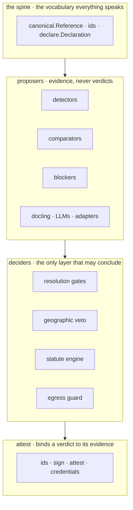
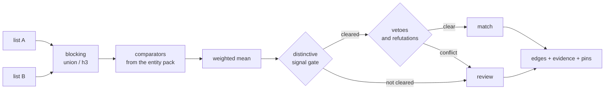
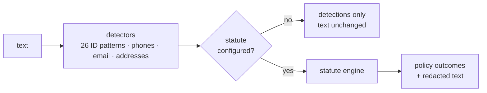
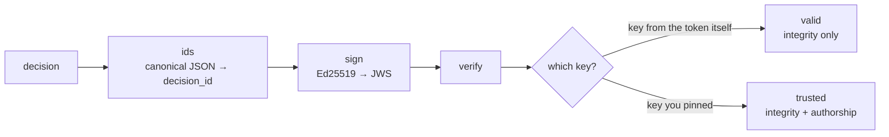

# Architecture

How arche is put together, what runs when you call it, and which component is allowed to decide anything.

## The organising idea

Almost everything in arche produces **evidence** and is forbidden to reach a verdict. A small, nameable set of components reaches verdicts, and each one has a rule you can quote. Attestation then binds a verdict to the evidence and the versions that produced it.

That is the layering. It is not `detect -> resolve -> protect -> attest`, which is a good description of what you can *do* with arche and a poor description of how it is built.



Read it bottom up. Nothing in the spine decides anything. Nothing in the proposer layer decides anything. The decider layer is short enough to list.

The practical consequence is that a detector being wrong, an LLM hallucinating, or an adapter returning nonsense cannot by itself produce a merge. It can only add evidence that a gate then judges.

## Path 1: resolve two lists

`crosswalk` is the main entry point. Two lists in, scored edges out.



Two things in that diagram carry most of the weight.

**The distinctive-signal gate.** A pair can only be `match` if some *distinctive* comparator (name, id, token-frequency) clears the floor, which defaults to 0.75. Supporting signals amplify, they never manufacture a merge. A shared coordinate with a weak name lands in `review`, never `match`.

**Refutation is asymmetric.** Some fields discriminate without confirming. A weight cannot express that, because a weight rewards agreement by exactly as much as it punishes disagreement. `refutes_below` demotes a pair to `review`, and `veto_km` does the same for distance. Neither ever returns `no_match`: a refutation says a human must look, not that the answer is no.

Missing evidence never refutes. A comparator with nothing to say returns nothing and drops out of the weighted mean, rather than scoring zero.

### The scorer is replaceable

`crosswalk(..., backend="splink")` hands the scoring to [Splink](https://moj-analytical-services.github.io/splink/) and keeps everything in the diagram after it: the gate, the vetoes, the evidence, the pins, the decision ids. The result shape does not change, so a review pack written from a Splink run is the same artifact.

This exists because arche's own matcher loses to Splink on every dataset it has been measured against, and the useful response to that is to use the better scorer rather than keep the gap. See [the benchmarks](benchmarks.md#arche-using-splink-rather-than-against-it).

Two arguments are required and neither has a default. `splink_settings=` takes a configuration you wrote, because a configuration inferred from an arche comparator pack orders pairs about as well as a hand-written one and cannot calibrate them. `threshold=` is required because a Splink probability has no portable scale: `p >= 0.99` merges 4,765 true pairs on one benchmark and nothing at all on another.

## Path 2: compare two records

`pairwise` answers "are these two the same?" and returns a signable `CoReferenceDecision`. It uses Fellegi-Sunter log-odds rather than `crosswalk`'s weighted mean, so **the two scores are not comparable**, on purpose.

The decision carries everything needed to re-derive it:

```
score          0.9871
decision_id    dec:sha256:fc5b9ce303...
gate           {'distinctive_cleared': False, 'clearing_signal': None, 'floor': 0.75}
factors        {'name': 0.9733, 'name_tf': 0.3465}
vetoes         {'id_conflict': False}
pins           {'engine': 'arche-core@0.6.0a1', ...}
```

`pairwise(entity="place")` raises. `crosswalk` is the place path.

## Path 3: find and protect PII in text

`Pipeline` detects, then applies whatever statute you selected.



**The branch on the left is the one to understand before using this.** With no statute, arche finds PII and does not touch the text:

```python
from arche.workflow import Pipeline

text = "Adesola Okonkwo, NIN 12345678901, adesola@example.com"

# No statute. The NIN and the email are both found, and nothing is changed.
plain = Pipeline().process(text)
assert len(plain.detections) == 2
assert plain.policy_outcomes == []
assert plain.redacted_text == text

# With a statute, the policy decides what happens to each field.
guarded = Pipeline(statute="NDPA-2023").process(text)
assert len(guarded.policy_outcomes) == 2
assert guarded.redacted_text.startswith("Adesola Okonkwo, NIN [NIN], EMAIL_")
```

No statute means no policy, and no policy means no permission to alter or emit anything. The field is called `redacted_text` in both cases. Treating it as safe without checking `policy_outcomes` is the mistake this design invites, and the reason the egress guard exists as a separate, fail-closed component.

Note also that `Adesola Okonkwo` survives both. The base rule-based pass carries no person-name detector for this jurisdiction, and no guard can tokenise a span nobody proposed. Neural NER is an opt-in extra, never on the critical path.

## Path 4: attest a decision



This distinction is the whole point and is easy to lose. `valid` answers "does this signature match this key". Only `trusted` answers "did that key come from somewhere I control". A self-asserted signature proves the bytes did not change; it proves nothing about who produced them.

## How people actually use it

| You want to | Call | You get |
|---|---|---|
| Link two lists | `resolve.crosswalk` | scored edges, evidence, pins |
| Link two lists with Splink | `crosswalk(backend="splink")` | the same, scored by Splink |
| Compare two records | `resolve.pairwise` | a signable decision |
| Find PII in text | `workflow.Pipeline` | detections, policy outcomes |
| Enforce before egress | `guard.EgressGuard` | fail-closed tokenised projection |
| Share a result | `report.crosswalk_report` | one self-contained HTML file |
| Send it for review | `report.review_pack` | a pack arche studio opens |
| Pull records out of documents | `doc` + `extract` | references with provenance |
| Describe your own schema | `declare.Declaration` | comparators, without code |

Entity packs shipped today: `person`, `place`, `organisation`, `artist`, `product_electronics`. A pack is configuration over one engine, never a fork, and `comparators=` overrides any of them.