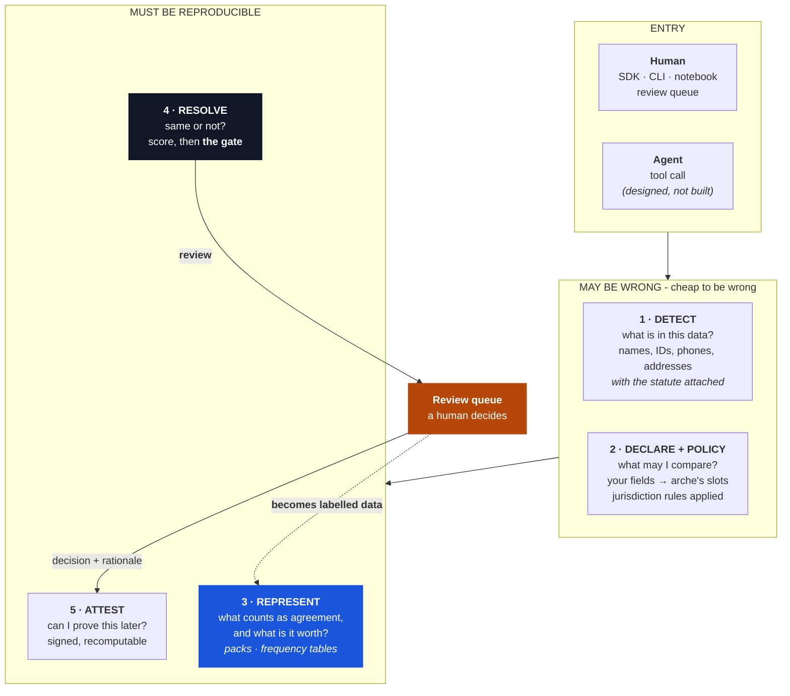

# arche in practice

*You have two lists that are supposed to describe the same things, and they disagree. This page follows that job from opening the files to handing someone an answer they can check.*

---

If you only read one paragraph: arche takes your two lists, decides which rows are about the same thing, tells you which ones it will not decide, and writes down why for every single row. The part that is unusual is the last bit. The reasoning is an output, not something you reconstruct afterwards from memory.

The rest of this page is that job in order.

1. [The afternoon it replaces](#the-afternoon-it-replaces)
2. [What you run, and what comes back](#what-you-run-and-what-comes-back)
3. [How much lands in the review queue](#how-much-lands-in-the-review-queue)
4. [Three worked cases](#three-worked-cases)
5. [What an agent would do](#what-an-agent-would-do)
6. [Four ways a business uses this](#four-ways-a-business-uses-this)
7. [What we are not defending against](#what-we-are-not-defending-against)

---

## The afternoon it replaces

A data officer at a health ministry has two facility lists. The national registry and an OpenStreetMap export. She needs one list. Today that afternoon looks like: sort both by name, eyeball the near-matches, make a judgement call on a few hundred, and produce a spreadsheet whose reasoning exists only in her head.

Three months later someone asks why two clinics were merged. There is no answer. Not because she was careless, because the format had nowhere to put one.

What arche changes is not mainly the accuracy. It is that **the reasoning survives the afternoon.**

---

### How the pieces fit



Two things worth noticing.

**Layer 3 is the product.** Layers 1, 2, 4 and 5 are engineering. Competent, unremarkable engineering. Layer 3 is the data nobody else ships, and it is where every claimed gain comes from.

**The dotted arrow points backwards.** When a person resolves an uncertain case, that answer improves the representation for every future decision. A review queue is normally drawn as a cost centre. It is the only part of the system that manufactures new ground truth.

---

## What you run, and what comes back

Three calls, and the middle one is the whole job.

```python
from arche.resolve import reconcile

report = reconcile(registry, osm_export, entity="place", id_field="id")
```

Then you read the verdicts, not the count. Every edge carries the evidence that produced it, so "why did it do that?" is answerable at the row level rather than as a matter of trust.

<details class="arche-examples" open>
<summary>The three outcomes, and what each one asks of you</summary>
<div class="arche-pairs">
<div class="pair match">
  <div class="pair-records">
    <code>Queen Elizabeth Hospital</code>
    <code>Queen Elizabeth Hospital Birmingham</code>
  </div>
  <div class="pair-verdict">match</div>
</div>
<p class="pair-why"><strong>name 0.94 · 0.06 km apart</strong>, one register appends the city, the other does not. Nothing for you to do. This is the bulk of the file and you should never have to look at it.</p>
<div class="pair review">
  <div class="pair-records">
    <code>Royal Infirmary          (Edinburgh)</code>
    <code>Royal Infirmary          (Manchester)</code>
  </div>
  <div class="pair-verdict">review</div>
</div>
<p class="pair-why"><strong>name 1.00 · 282.31 km apart</strong>, identical names, two hospitals. This one is <em>your</em> decision, and the row already tells you which fact to check. That is the difference between a queue and a pile.</p>
<div class="pair different">
  <div class="pair-records">
    <code>Valif Pharmacy</code>
    <code>Ikpoba Hill Health Centre</code>
  </div>
  <div class="pair-verdict">different</div>
</div>
<p class="pair-why">Nearby, and not the same thing. A tool that reported a confident 90% match rate on a list like this would be lying to you.</p>
</div>
</details>

The workflow change is narrow and specific:

| | before | after |
|---|---|---|
| **What you look at** | every near-match | the `review` queue only |
| **What you produce** | a spreadsheet of decisions | decisions **plus** the evidence for each |
| **"Why this merge?" in month six** | reconstruct from memory | read the row |
| **Re-run next year** | different answers, no explanation | same `decision_id`, or a recorded reason it moved |
| **Your judgement calls** | evaporate | become training data for the next run |

That last row is the compounding one. In most tools the human review is pure cost. Here it is the only input that creates knowledge the system did not previously have.

## How much lands in the review queue

This is the question everyone asks second, right after "is it accurate".

On the one file where the truth is fully known, a 10,000-record synthetic register, about **12% of proposed pairs** came back as `review`. The rest were decided automatically.

Be careful how you read that, because it is the number most likely to be quoted out of shape. It is not a general rate. It moves with how messy your data is, how many distinctive fields you carry, and where the thresholds sit. A file with national IDs on most rows will defer far less. A file of names and towns will defer far more.

Two honest things about it:

**The 12% is not free, and we do not currently charge ourselves for it.** Reporting perfect precision while quietly setting the hard cases aside is a way of scoring well on the easy ones. Any real deployment needs a review budget fixed in advance, and a headline number that counts the deferred cases rather than excusing them.

**The queue is the part that pays you back.** Every case a person settles becomes a labelled example, and labelled examples are what let the thresholds be set from evidence instead of by hand. Nothing else in the system produces them.

---

---

## Three worked cases

### A person, and why the system refuses

Two clinic registers. Both records read *Ibrahim Musa*, both in Kano.

```text
identity: review | action: no_op | score: 0.9985
gate: {'distinctive_cleared': False, 'clearing_signal': None, 'floor': 0.75}
```

Everything agrees perfectly and the answer is still *I don't know*, because no **distinctive** signal cleared. `musa` scores 0.73 against a 0.75 floor. Two identical common names in a city of millions is not evidence of one person. Add a shared phone and it releases as `same_entity | merge | basis: corroborated`: the phone cleared the gate *and* the name independently agreed. A lone phone with nothing else returns `hold`, not `merge`.

The reasoning is in sameness and similarity. What matters here is the shape: **the score did not decide this. A stated policy did, and you can read the policy.**

### A place, and a lexicon that must not apply

*Karfi Primary Health Centre* against *Karfi PHC*, 160 metres apart:

```text
decision: review   score: 0.5779
evidence: {'name': 0.837, 'name_tftoken': 0.133, 'name_type': 1.0,
           'geo': 0.949, 'distance_km': 0.16}
```

Read `name_tftoken: 0.133`. The only *distinctive* shared token is *Karfi*. "Primary", "Health", "Centre" and "PHC" are near-worthless in a facility list where thousands of rows contain them.

And the place path deliberately does **not** consult the person name lexicon, which scores *Fatima ≡ Fatouma* at 1.0. Two facilities named after two different women are two facilities. Getting the type of an equivalence wrong is worse than having no equivalence at all.

### An organisation, and the case that breaks every signal at once

The newest lane, and the one that shows why this is not just string matching.

```text
with entity_class      -> review   score=0.8882
without entity_class   -> match    score=0.8882
```

Same score. Opposite verdict. The pair is `Nyeri Hill Factory` (a tea factory) against `Nyeri Hill Tea Factory Co Ltd` (the company operating it). They share a name and sit at the *same coordinate*, because one is on top of the other. Name similarity says match, geography says match, and stripping the shared legal form leaves them *more* alike, not less.

**Every signal points the wrong way at once.** Only a declared class refutes it. Weighted at zero, so agreement adds nothing and disagreement demotes to review, and missing-value-safe, so a file without the field degrades to *cannot tell* rather than silently merging.

That is what a representation layer buys you that a better estimator cannot.

---

## What an agent would do

An agent asked *are these the same person?* can guess, or it can call something. If it guesses, the answer is unattributable and irreproducible. If it calls a tool that returns a decision, a basis, a gate state and a signable artifact, it can honestly say *I don't know*, because `review` is an available answer.

Giving an agent the ability to **abstain with evidence** is most of what makes it safe to automate.

!!! danger "`arche-mcp` is not built"

    An earlier draft of this page said arche exposes seven MCP tools and described their security behaviour. **None of that code exists.** There is no MCP module in this repository and none in the wheel.

    That claim is corrected here rather than quietly deleted, because it asserted security properties of software that was never written, which is precisely the failure mode this project exists to argue against, committed by us.

    The design is real, the four verbs map cleanly onto tools, and nothing about its behaviour should be relied on until it is on PyPI with tests.

Today the agent path is the same Python API a person uses. The argument for the shape stands regardless: **you do not compete with the agent, you become what it calls when the answer has to be defensible.** The agent brings reasoning, memory and context management, and will keep getting better at them. arche brings adjudication and attestation. That position improves as agents improve, but it is a position, not a shipped feature.

---

## Four ways a business uses this

In increasing order of how much they depend on the signing layer.

**1 · Deduplicate one registry.** A ministry, insurer or lender has one list with unknown internal duplicates. Value is immediate and countable: the duplicate rate and the money attached to it. Needs `resolve`, not `attest`.

**2 · Reconcile across parties.** Two organisations hold lists of the same real-world entities under different conventions. Output is a crosswalk plus a review queue. This is the unsolved case, and where calibration earns its keep.

**3 · Answer a question with evidence.** A bank must show it screened a customer; an importer must show suppliers were reconciled before a declaration. The product is not the match, it is the **defensible artifact**, and a signed `different` is worth as much as a signed `same_entity`. Nobody currently sells *we checked, this person is not on the list, here is the proof.*

**4 · Be the tool an agent calls.** Grows with agent adoption rather than competing with it. See the caveat above.

Where value is captured is deliberately not where the packs sit. **The representation data is open**, because a pack everyone corrects is a better pack and corrections are the flywheel. What is sold is the adjudication surface, the review workflow, and the assurance that a decision still verifies in seven years.

---

## What we are not defending against

Named plainly, because these are the gaps a hostile reviewer would find first.

**Adversarial identity.** Everything above assumes records are *noisy*, not *hostile*. Identity systems are exactly where adversaries live. Ghost workers, duplicate beneficiaries, sanctions evasion through transliteration. And the uncomfortable corollary: **the equivalence packs are an attack surface.** A published fact that *Mohammed ≈ Mamadou* is also a published instruction for crafting a name that merges into someone else's identity, or one that splits you into two beneficiaries by avoiding an equivalence. There is no systematic threat model, and there should be one before any deployment that decides benefits.

**Federated resolution without pooling.** The cross-party case requires organisations that legally *cannot* share raw records to nonetheless reconcile. There are pseudonymous identifiers and references to privacy-preserving linkage, but no protocol: no Bloom-filter encoding, no private set intersection, no two-party flow. This is the largest architectural gap between what exists and the commercial story.

**The subject-facing surface.** A signed decision is accountability infrastructure only if someone can contest it. `attest` produces something a *regulator* or *counterparty* can verify. Nothing produces something the *person whose records were merged* can see and challenge. NDPA and GDPR both grant rectification rights; the appeal path is undesigned. **A signature creates a blame record, not contestability**, and the difference is the whole point.

**Ontology alignment before resolution.** Two parties may not agree what an entity *type* is. In cocoa, "farm" may mean a plot, a farmer or a household. That is not a matching problem, it precedes matching, and resolution across mismatched ontologies produces confident nonsense.

---

## Where to go next

This is the last page in the path. Back to **[The whole picture](../about/the-whole-picture.md)** for what is built and measured, or **Sameness and similarity** for the argument underneath it.

## Related

- Sameness and similarity. Why the gate exists, and whether frontier models make it redundant
- The whole picture. What is measured, and how the baselines were chosen
- [What matching looks like](what-matching-looks-like.md). The failure modes side by side
- [Re-verify a decision](../how-to/re-verify-a-decision.md). The third-party checking path
